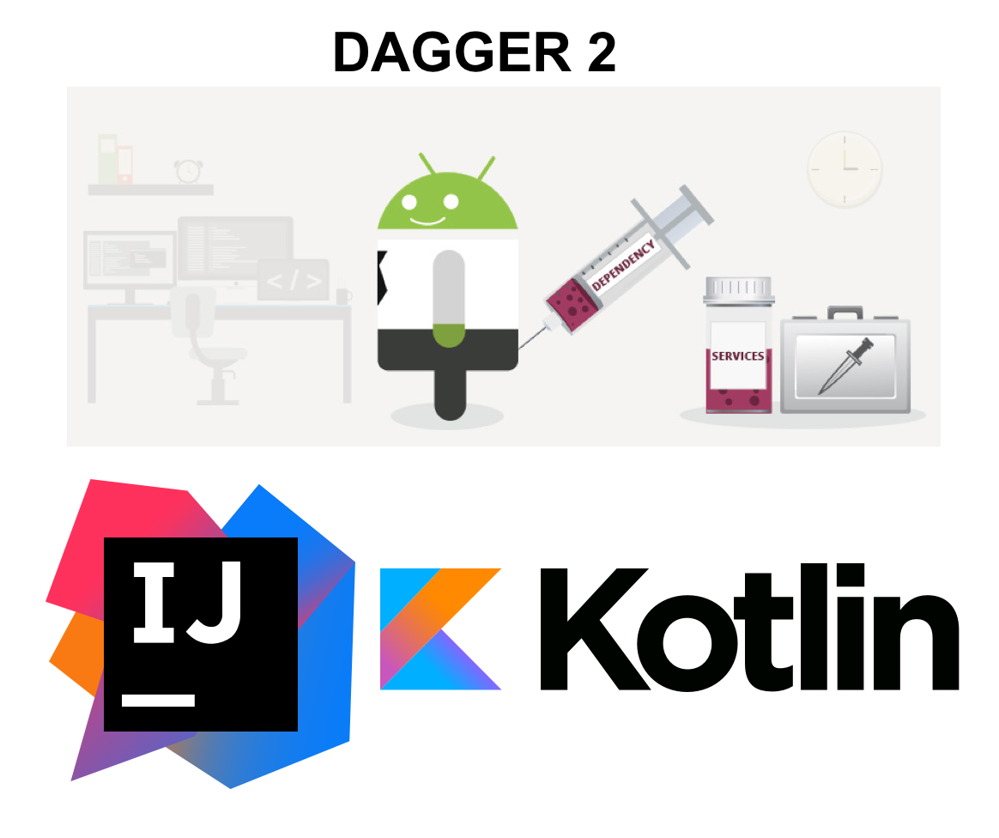
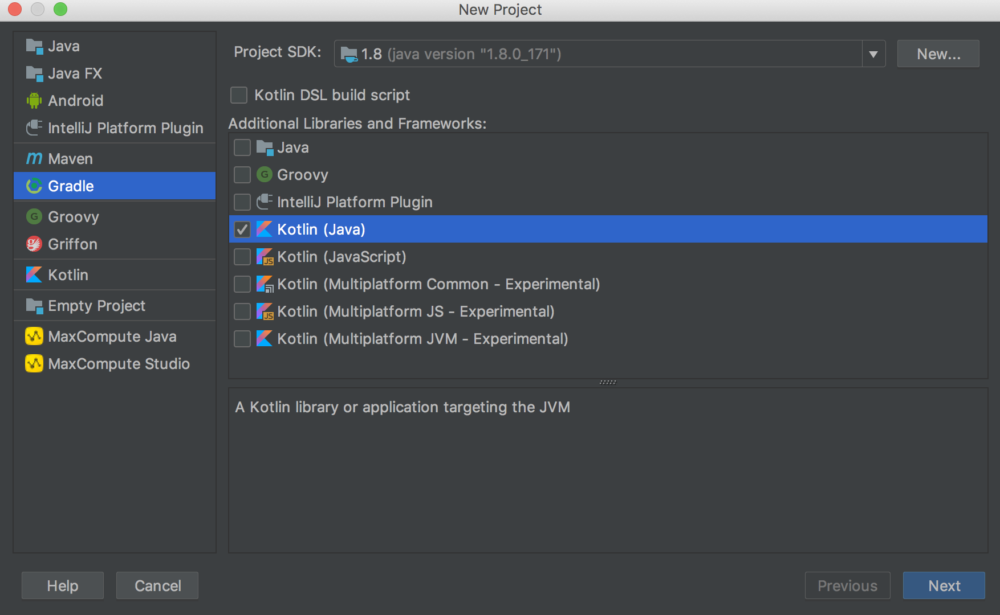

<h1 align="center">Google CoffeeApp Gradle Project </h1>
<h2 align="center">Kotlin, Dagger2 and Intellij IDEA </h2>

    

## Setting Up
1. Creating a new project.

    

## Getting Started

If you have some problems visit:
[CoffeeApp java Intellij Repository](https://github.com/CarlitosDroid/google-coffeapp-java-intellij).
